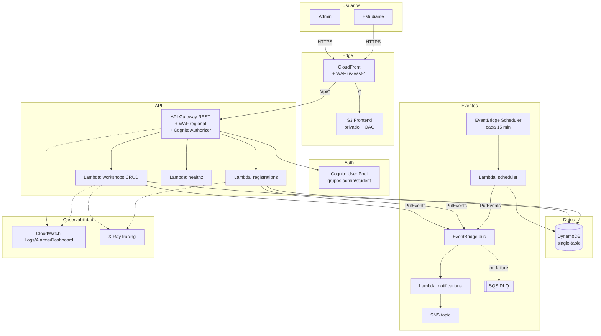

# Arquitectura

## Diagrama de alto nivel

## Componentes

| Componente | Servicio AWS | Propósito |
|---|---|---|
| Frontend | S3 (privado) + CloudFront + OAC | Hosting estático, sin acceso público directo al bucket |
| Auth | Cognito User Pool + grupos `admin`/`student` | Login, emisión de JWT, control de roles |
| API | API Gateway REST + Cognito Authorizer | Enrutamiento, throttling, CORS, logging |
| Compute | Lambda (Python 3.12) | Lógica de negocio: CRUD talleres, registro, notificaciones, recordatorios |
| Datos | DynamoDB (on-demand, single-table) | Talleres e inscripciones |
| Eventos | EventBridge (bus custom) | Desacople: `WORKSHOP_CREATED`, `STUDENT_REGISTERED`, `WORKSHOP_REMINDER`, `WORKSHOP_DELETED` |
| Notificaciones | SNS + email | Confirmaciones y avisos |
| Reintentos | SQS DLQ en la regla de EventBridge | Captura eventos que fallan tras 3 reintentos |
| Recordatorios | EventBridge Scheduler (rate 15 min) + Lambda | Detecta talleres que inician en ~24h y notifica inscritos |
| Seguridad | WAF (API Gateway regional + CloudFront en us-east-1), IAM least-privilege, S3 privados | Protección de borde y de API |
| Observabilidad | CloudWatch Logs/Alarms/Dashboard + X-Ray | Trazabilidad y alertas |
| Costos | AWS Budgets + tagging `Project`/`Env` | Control de gasto |

## Decisiones de diseño

### Single-table DynamoDB
Se optó por una sola tabla con `PK`/`SK` genéricos en lugar de tablas separadas por entidad, siguiendo el patrón estándar de DynamoDB para minimizar el número de consultas por operación:

- `WORKSHOP#<id>` / `META` — datos del taller.
- `WORKSHOP#<id>` / `REG#USER#<userId>` — inscripción (permite listar inscritos de un taller con una sola query por `PK`).
- `GSI1` (`WORKSHOP#ALL` / `startAt`) — listado cronológico global, usado también por el scheduler de recordatorios (`BETWEEN` sobre `GSI1SK`).
- `GSI2` (`CATEGORY#<cat>` / `startAt`) — filtro por categoría sin escanear la tabla.

### Autenticación y autorización en dos capas
- **API Gateway** valida el JWT de Cognito en todas las rutas de escritura (`POST`/`PUT`/`DELETE` de talleres, registro).
- **Dentro del handler** se verifica el grupo `cognito:groups` para diferenciar `admin` de `student` — API Gateway no soporta autorización por grupo nativamente en un Cognito Authorizer simple, así que ese chequeo vive en `common/auth.py` (`is_admin`).
- Las rutas de lectura (`GET /workshops`, `GET /workshops/{id}`) se marcan explícitamente `Authorizer: NONE` para mantenerlas públicas.

### Un Lambda por dominio, no por endpoint
`workshops/app.py` enruta internamente los 5 métodos CRUD (`route()` por `httpMethod`+`resource`) en vez de tener 5 funciones separadas. Reduce cold starts duplicados y simplifica el template; la lógica de cada verbo sigue aislada en su propia función Python dentro del mismo archivo.

### EventBridge en bus custom, no en el bus default
Se usa un bus dedicado (`workshops-bus-<env>`) en vez del bus `default` de la cuenta para aislar el tráfico de eventos del dominio y facilitar el filtrado/auditoría independiente de otras cargas de trabajo en la misma cuenta.

### WAF de CloudFront en stack separado (us-east-1)
AWS exige que un `WAFv2::WebACL` con `Scope: CLOUDFRONT` se cree en `us-east-1`, sin importar en qué región vive el resto de la infraestructura. Se creó `waf-cloudfront.yaml` como stack independiente desplegado siempre en us-east-1; su ARN se pasa como parámetro (`CloudFrontWebAclArn`) al stack principal. Esto evita forzar todo el backend a us-east-1 solo por este requisito.

### Sin blue/green (CodeDeploy) por limitación de cuenta
El diseño original contemplaba `AutoPublishAlias` + `DeploymentPreference` (Canary10Percent5Minutes) vía CodeDeploy. En el entorno de despliegue real, la cuenta AWS no tiene el servicio CodeDeploy suscrito/habilitado (`SubscriptionRequiredException`), por lo que se optó por `AutoPublishAlias: live` sin `DeploymentPreference`: cada deploy publica una nueva versión y mueve el alias `live` directamente, sin despliegue progresivo. Ver `despliegue.md` para cómo reactivar blue/green si se habilita CodeDeploy.

### Presigned URLs para evidencias/brochures
El bucket `EvidenceBucket` es completamente privado (sin política pública). El acceso a archivos (subida o descarga) se hace exclusivamente vía URLs pre-firmadas generadas por un Lambda (no incluido en el alcance mínimo de este módulo, ya que no hay endpoint de evidencias en el contrato de API actual) — queda documentado como próxima extensión natural del backend.

## Seguridad — detalle

- **WAF API Gateway** (`ApiWebAcl`, región del backend): regla de rate-limit (2000 req/5min por IP) + `AWSManagedRulesCommonRuleSet` + `AWSManagedRulesSQLiRuleSet`.
- **WAF CloudFront** (`waf-cloudfront.yaml`, us-east-1): rate-limit + `AWSManagedRulesCommonRuleSet`.
- **IAM least-privilege**: cada Lambda usa políticas generadas por SAM (`DynamoDBCrudPolicy`, `DynamoDBReadPolicy`, `SNSPublishMessagePolicy`) acotadas al recurso específico (tabla, tópico) en vez de wildcards `*`.
- **S3**: `FrontendBucket` y `EvidenceBucket` bloquean todo acceso público (`PublicAccessBlockConfiguration` con los 4 flags en `true`); el frontend se sirve exclusivamente vía CloudFront con Origin Access Control (OAC).
- **CORS**: configurado en API Gateway (`AllowOrigin: '*'` en dev; se recomienda restringir al dominio de CloudFront en prod, ver `operacion.md`).
- **Throttling**: `ApiThrottleRateLimit`/`ApiThrottleBurstLimit` parametrizados por ambiente (50/100 en dev, 200/400 en prod).
